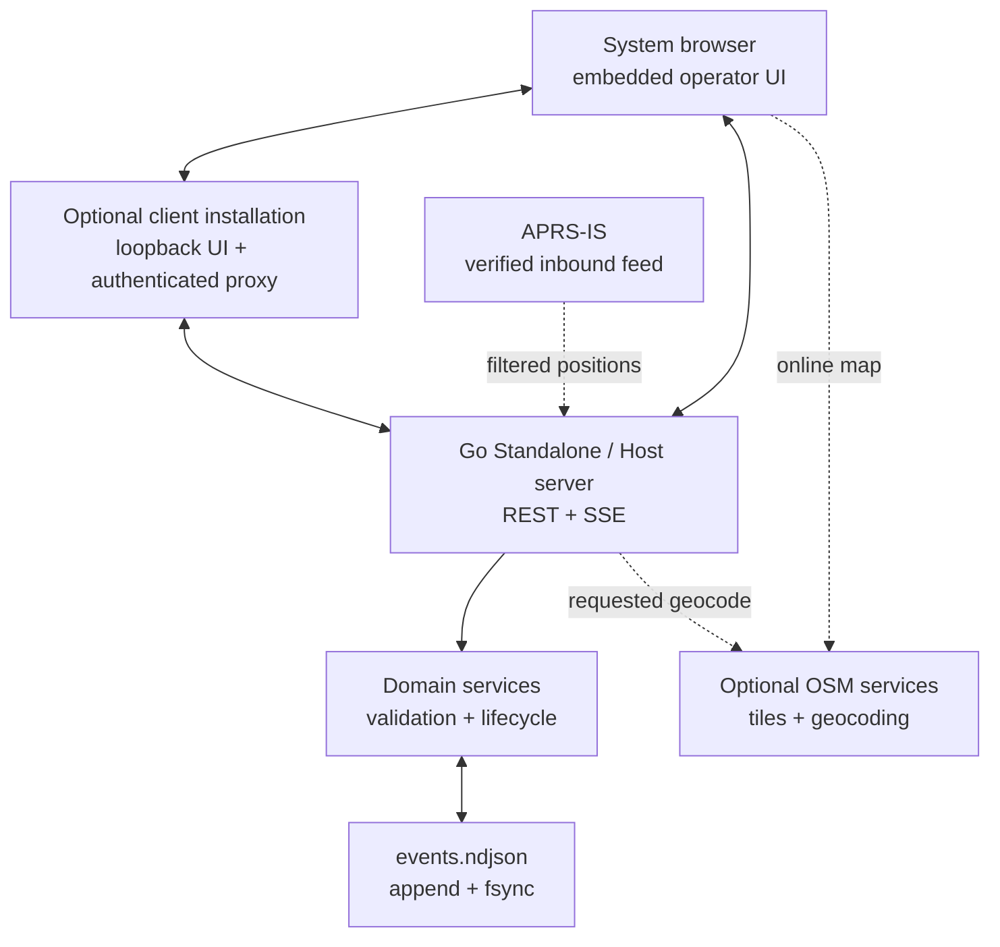

# Architecture

## Goals

Tickets Local keeps the useful dispatch concepts in Tickets CAD while removing
the end-user requirements for PHP, a web server, MySQL, Docker, Node, or a
bundled Chromium runtime.

The release is a statically linked Go executable of roughly 6–7 MB. At launch it:

1. resolves the OS application-data directory;
2. replays the append-only event log into memory;
3. loads the local Standalone, Host, or Client role;
4. binds to loopback for Standalone/Client or the selected LAN port for Host;
5. serves an embedded HTML/CSS/JavaScript console; and
6. opens the system browser.

No cloud service is required for core CRUD, dispatch, or audit operations.

## Relationship to Tickets CAD

The implementation was informed by the operational tables and workflows in
`openises/tickets`, especially:

- `ticket` — incident identity, scope, location, severity, and lifecycle;
- `responder` — unit identity, status, capabilities, and coordinates;
- `assigns` — incident-to-responder assignment;
- `action` — timestamped incident activity;
- `facilities` — destinations, status, and capacity;
- the Situation, Units, Facilities, Search, and activity-log workflows; and
- the NewUI direction toward Leaflet/OpenStreetMap and SSE updates.

The runtime and data model are a clean local implementation rather than a PHP
port. Source compatibility is not claimed.

## Components

### API

All mutations validate a bounded JSON request and return a saved domain object.
Unknown fields are rejected. The browser refreshes state after writes and also
listens to `/api/events` for cross-tab changes.

In Client mode, operational API routes are proxied to the configured Host with
the locally stored LAN key and computer name. Local network-role and shutdown
routes are never proxied. The Host owns all operational persistence and APRS
providers; Clients do not replicate or merge independent databases.

Important routes:

| Route | Purpose |
|---|---|
| `GET /api/state` | Complete current local state |
| `POST/PUT /api/incidents...` | Incident lifecycle |
| `POST/DELETE .../assignments...` | Unit dispatch and clear |
| `POST .../actions` | Incident action log |
| `POST/PUT /api/responders...` | Unit records and status |
| `POST/PUT /api/facilities...` | Facility and capacity records |
| `POST/PUT/DELETE /api/locations...` | Reusable saved places |
| `POST /api/overlays/import` | Bounded multipart KML import |
| `PUT/DELETE /api/overlays...` | Overlay visibility, color, and lifecycle |
| `POST /api/overlays` | Persistent interactive map drawing |
| `GET /api/map/tiles...` | Cache-through Host-owned base-map tiles |
| `GET/POST/DELETE /api/map/packs...` | Offline map-pack management |
| `POST /api/map/route` | Bounded optional route-provider request |
| `POST/PUT/DELETE /api/assets...` | Vehicles and equipment inventory |
| `POST/PUT/DELETE /api/schedule...` | Shared operational schedule |
| `POST/PUT/DELETE /api/qualifications...` | Responder training and credentials |
| `POST /api/messages` | Append-only internal operational messages |
| `POST /api/responders/{id}/position` | One-time browser device position |
| `POST /api/tracking/owntracks/{responder}` | Authenticated OwnTracks location ingest |
| `GET/POST /api/tracking/opengts/{responder}` | Authenticated OpenGTS-compatible HTTP location ingest |
| `PUT /api/settings` | Local organization/map configuration |
| `GET /api/aprs/status` | Internet and local RF APRS health and counters |
| `POST /api/aprs/reconnect` | Restart the selected APRS connections |
| `GET/PUT /api/network/settings` | Read or save this computer's local role |
| `POST /api/network/test` | Validate a proposed Host address, key, role, and version |
| `GET /api/network/status` | Active role, restart state, addresses, and recent Clients |
| `POST /api/mobile/enroll` | Redeem a short-lived, single-use phone enrollment token |
| `GET /api/mobile/state` | Device-scoped responder assignment and active incidents |
| `PUT /api/mobile/status` | Device-scoped status update for its bound responder |
| `/api/mobile/admin/...` | Host-local QR enrollment and device revocation |
| `GET /api/connections` | Bounded live diagnostics for LAN peers and enabled providers |
| `GET /api/events` | Server-Sent Event notification stream |
| `GET /api/backup` | Replayable event-log download |
| `GET /api/geocode` | Rate-limited, operator-requested Nominatim query |
| `GET /api/integrations` | Cached storm, infrastructure, repeater, MeshCore, AREDN, and sensor awareness |
| `POST/GET /api/incidents/{id}/attachments...` | Bounded Host-owned incident files |
| `GET /api/incidents/{id}/export?format=...` | Preview-only Winlink and ICS output |
| `POST /api/incidents/{id}/winlink-email` | Validated `.eml` handoff; never sends mail |
| `GET /api/backup/archive` | Complete ZIP containing the event log and attachments |
| `POST /api/restore/validate` | Non-mutating NDJSON restore dry run |
| `POST /api/restore/apply` | Hash-bound restore with mandatory prior-log backup |

### Persistence

Each event contains a version-independent envelope and a current entity snapshot.
A mutation is reported successful only after the event line is written and
`fsync` completes. Startup replays the log to reconstruct state. The model makes
the audit trail native and enables future projection or migration tools.

The first schema version is intentionally simple. Future event changes should:

1. preserve old event readers;
2. introduce an explicit migration/replay test;
3. never rewrite an operational log in place; and
4. produce a new backup before any compaction.

After successful replay, Standalone and Host roles copy a changed event log to
an owner-readable timestamped file at most once per day. The copy is written,
synced, and atomically renamed without modifying `events.ndjson`; the newest 14
copies are retained. Client mode does not snapshot its non-authoritative store.

### APRS providers

The APRS manager runs independently selectable Internet and Local RF providers.
The Internet provider opens a TCP connection to the configured APRS-IS filtered
port, sends the configured callsign and passcode, and requires a matching
`logresp ... verified` response before declaring the feed live. Internet-only
is the default and does not start the local provider.

The Local RF provider reads AX.25 UI frames over KISS TCP from either a
supervised bundled Dire Wolf process or an existing TNC. The generated Dire
Wolf configuration decodes 1200-baud audio and exposes a dedicated KISS port.
It does not configure PTT, beaconing, digipeating, or Internet-to-radio gating.
An explicit iGate option can ask Dire Wolf to forward eligible RF packets to
APRS-IS, but only after the application's separate APRS-IS connection has
validated the same login.

Standard, compressed, timestamped, third-party-wrapped, and Mic-E station
positions are decoded. Matching positions update the responder projection and
append a source-labeled track event. Hybrid mode suppresses RF and APRS-IS
copies of the same packet even when their network paths differ. Displayed
history is bounded, and connections retry with exponential backoff. Runtime health is
kept in memory; non-secret APRS configuration is stored with settings. The
passcode is stored in a separate owner-readable local file and is excluded from
the append-only event log and backup endpoint.

### LAN roles and security boundary

v0.5 defaults to Standalone and binds only to `127.0.0.1`. Client mode also
binds only to loopback, keeps the embedded UI local, and proxies operational
requests to one configured Host. Host mode is the only role that binds to a LAN
interface. Non-loopback Host API and health requests require a cryptographically
random LAN access key; comparison is constant-time. The key is kept in an
owner-readable `network.json`, never in the operational event log or backup.

The LAN protocol uses HTTP because this release targets a trusted private
network and avoids certificate deployment on every field computer. The shared
key prevents casual or accidental access but does not provide per-user identity
or encryption against a hostile LAN participant. Do not port-forward the Host
or expose it directly to the Internet. A future remote-access module should add
TLS, named accounts, RBAC, session expiry, and a formal trust bootstrap.

Each whole-record edit includes the version timestamp seen by the editor.
The Host rejects a stale mutation with HTTP 409, preventing one Client from
silently overwriting a newer change. Atomic action-note and assignment routes
remain serialized by the Host store mutex.

Authentication must be implemented before any LAN listener is added. The next
networked profile should include password hashing, session rotation, CSRF
protection, RBAC, TLS guidance, log actor identity, and a data-directory process
lock.

Mobile QR enrollment is available only in active Host mode. Host-local Settings
creates a 256-bit single-use token held in memory for at most 10 minutes; the QR
contains the selected LAN URL and that token, never the shared LAN key. On
redemption the Host issues a separate 256-bit device credential bound to one
responder. Only its SHA-256 hash is persisted in owner-readable
`mobile-devices.json`, which remains outside the event log and backups. Device
credentials authorize only the narrow mobile state and responder-status routes
and can be revoked independently. This improves credential isolation but does
not add transport encryption; the trusted-private-LAN restriction still
applies.

## Extension order

Recommended implementation sequence:

1. complete-backup ZIP restore with attachment reconciliation;
2. local user identity and RBAC;
3. patient and major-incident records;
4. offline map packs and interactive map markups;
5. additional location and radio providers; and
6. scheduling/personnel/equipment modules.

Provider integrations should sit behind narrow interfaces and store their
configuration separately from the domain event stream. Optional integrations
must not increase the default installation burden.

Repeater and MeshCore awareness follows the same rule. The authoritative Host
fetches configured read-only exports and shares normalized, cached points with
Clients. Tickets Local does not scrape listing sites, redistribute restricted
databases, connect directly to BLE radios, or transmit onto MeshCore. MeshCore
gateways expose a version-1 JSON envelope containing a bounded `nodes` array;
each node has `id`, `name`, `type`, `latitude`, `longitude`, and optional
`last_seen_at`, `snr`, `battery_percent`, and `details` fields.

Incident attachment metadata is stored in append-only incident snapshots.
Attachment bytes live under the authoritative Host data directory and transfer
through authenticated operational API routes in Client mode. The legacy NDJSON
backup remains replayable; Complete backup adds all attachment bytes in a ZIP.

Reviewed incident exports are generated from the Host-owned projection and are
never added to the event log. The browser presents an editable preview and
creates a local download only after an operator click. Tickets Local has no
Winlink transport, mail credentials, or automatic transmission route.
For Winlink email handoff, the Host validates one recipient address, precedence,
subject, and the reviewed body, then returns an RFC 822 `.eml` payload. The
browser downloads that file for an external mail client; the operator remains
responsible for opening it, reviewing the final addressing, and pressing Send.
